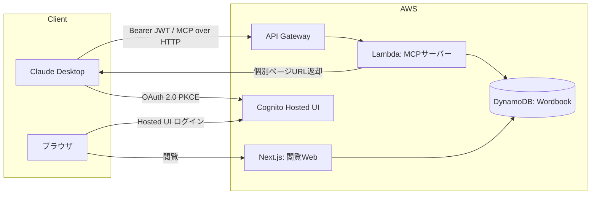
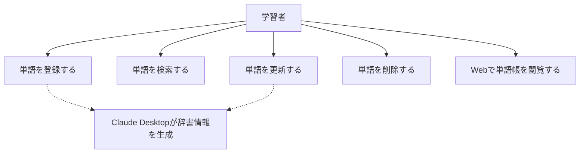
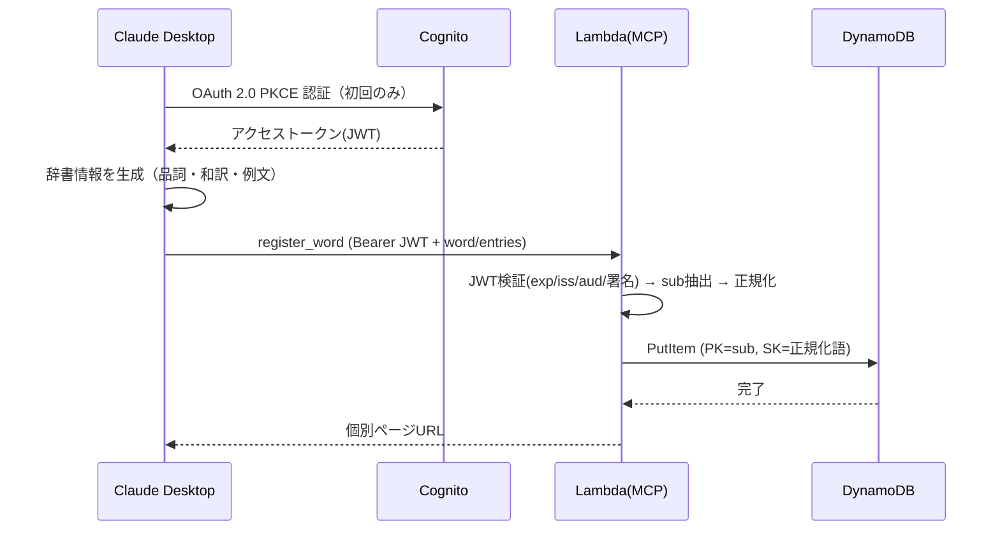

# 機能設計書

## 概要

### PRDとの対応関係

本書は PRD(001) の「MCP経由CRUD + Web閲覧」という要求を、AWS上の具体的なコンポーネント構成・データフロー・インターフェースに落とし込む。辞書情報の生成主体は Claude Desktop 側であり、MCPサーバーは受け取ったデータの永続化と閲覧URLの返却のみを担う。

### 設計スコープ

- 対象：MCPサーバー（4ツール）、認証基盤（Cognito OAuth 2.0 PKCE）、永続化層（DynamoDB）、閲覧用Web（Next.js）
- 対象外：辞書情報の生成ロジック（Claude Desktop側）、音声読み上げ（次フェーズ）

## システム構成図



## 機能別アーキテクチャ

| 機能 | 責務 | 実装レイヤー |
| --- | --- | --- |
| MCPツール実行 | JWT検証 → 入力バリデーション → 単語正規化 → DynamoDB操作 → 結果整形 | Lambda |
| 認証 | Hosted UIでのログイン、JWT発行・失効管理 | Cognito |
| 閲覧 | 一覧・モーダル・個別ページのレンダリング、セッション管理 | Next.js |
| 永続化 | ユーザー単位の単語データCRUD、前方一致検索 | DynamoDB |

MCPツールは共通ミドルウェア（JWT検証→`sub`抽出→正規化）を通した上で、各ツールのハンドラに分岐する。

## データモデル

### エンティティ構造

```json
{
  "userId": "cognito-sub-uuid",
  "word": "book",
  "entries": [
    { "partOfSpeech": "noun", "translation": "本、書籍", "examples": [{ "en": "...", "ja": "..." }] }
  ],
  "createdAt": "2026-01-01T00:00:00Z",
  "updatedAt": "2026-01-01T00:00:00Z"
}
```

### キー設計

| 項目 | 値 |
| --- | --- |
| パーティションキー(PK) | `userId`（Cognitoの`sub`） |
| ソートキー(SK) | 正規化済み英単語 |
| 前方一致検索 | `Query(PK=userId, SK begins_with "...")`。GSI不要 |

## ユースケース図



## シーケンス図

単語登録フロー（認証込み）：



## API / MCPツール設計

| ツール名 | 入力 | 正常系 | 異常系 |
| --- | --- | --- | --- |
| `register_word` | `word: string`, `entries: Entry[]` | 個別ページURL（既存時は既存URLを返し上書きしない） | バリデーションエラー内容 |
| `delete_word` | `word: string` | 削除完了メッセージ | 単語が存在しない旨 |
| `update_word` | `word: string`, `entries: Entry[]` | 個別ページURL（全フィールド全置換） | 単語が存在しない旨 |
| `search_words` | `prefix: string` | 一致単語一覧（最大20件・アルファベット順・21件以上は件数超過メッセージ付き） | 0件の旨 |

`Entry = { partOfSpeech: PartOfSpeech, translation: string, examples: { en: string, ja: string }[] }`

全ツール共通：Bearer JWT を必須とし、検証失敗時は 401 を返す（Claude DesktopがHosted UI再認証を起動）。個別ページURLは正規化済み英単語をURLエンコードした値を含む（例：`/wordbook/pick%20up`）。
