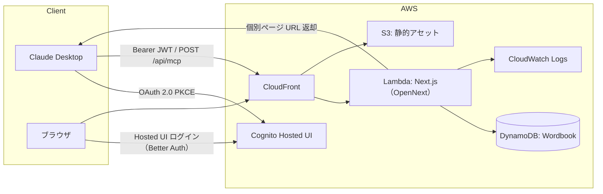
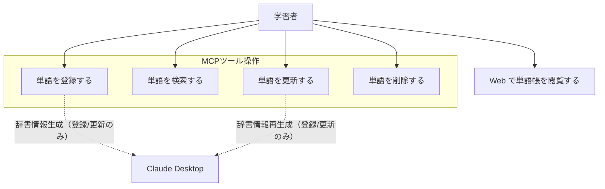
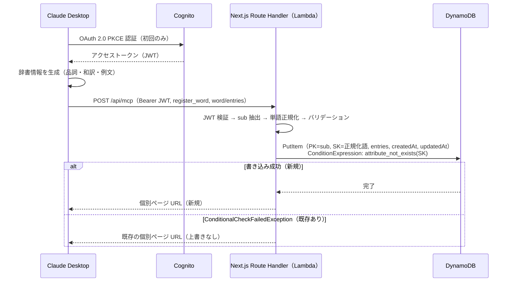
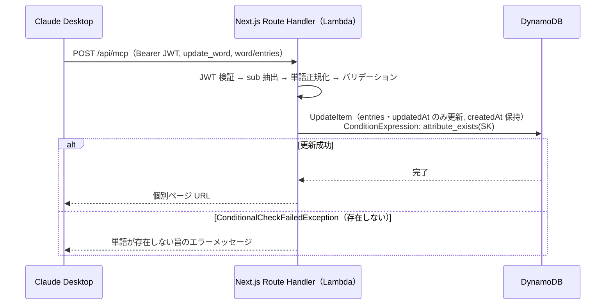
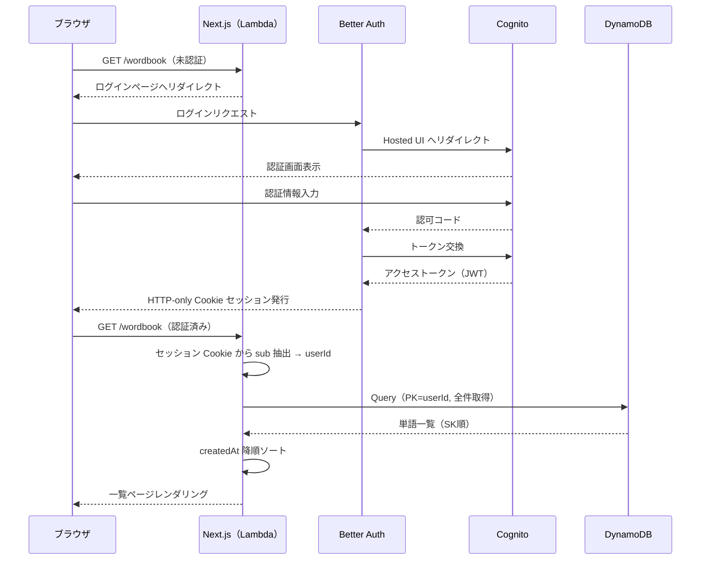

# 機能設計書

## 概要

### PRDとの対応関係

本書は PRD(001) の「MCPツール経由 CRUD + Web 閲覧」要求を、AWS 上の具体的なコンポーネント構成・データフロー・インターフェースに落とし込む。辞書情報の生成主体は Claude Desktop 側であり、MCP サーバーは受け取ったデータの永続化と閲覧 URL の返却のみを担う。

### 設計スコープ

- **対象**：MCP サーバー（4 ツール）、認証基盤（Cognito OAuth 2.0 PKCE）、永続化層（DynamoDB）、閲覧用 Web（Next.js）
- **対象外（本書）**：辞書情報の生成ロジック（Claude Desktop 側）、音声読み上げ（次フェーズ）
- **対象外（003 技術仕様書に委譲）**：性能要件の詳細・コスト最適化・IAM 詳細設計

## システム構成図



## 機能別アーキテクチャ

| 機能 | 責務 | 実装レイヤー |
| --- | --- | --- |
| MCP ツール実行 | JWT 検証（API ルート内自前実装） → 単語正規化 → バリデーション → DynamoDB 操作 → 結果整形 | Next.js API ルート（`/api/mcp`） |
| 認証（MCP） | OAuth 2.0 PKCE フロー、JWT 発行・失効管理 | Cognito |
| 認証（Web） | Better Auth による Hosted UI ログイン、HTTP-only Cookie セッション発行 | Next.js + Cognito |
| Cognito ユーザー管理 | セルフサインアップ無効・管理者作成のみ・初回パスワード変更強制 | Cognito（管理者操作） |
| 閲覧 | 一覧・モーダル・個別ページのレンダリング | Next.js（SST `NextjsSite`） |
| 永続化 | ユーザー単位の単語データ CRUD、前方一致検索 | DynamoDB |
| 監視 | Lambda・CloudFront ログ出力 | CloudWatch Logs |

MCP ツールと Web 閲覧画面は同一の Next.js アプリに統合する。MCP エンドポイントは Next.js の Route Handler（`app/api/mcp/route.ts`）として実装し、共通ミドルウェアチェーンを通過した後、JSON-RPC の `method` フィールドに基づき各ツールハンドラへ分岐する。

```
POST /api/mcp リクエスト
  → JWT検証（exp / iss / client_id / token_use === "access" / Cognito公開鍵署名） → 401 or next
  → 正規化（word および prefix を小文字・全角→半角・空白処理）
  → バリデーション（正規化後の値でスキーマチェック） → エラーメッセージ or next
  → ツールハンドラ（register / delete / update / search）
```

Cognito のアクセストークンは `aud` クレームを持たない。代わりに `client_id`（Cognito アプリクライアント ID と一致するか）と `token_use === "access"`（ID トークンとの取り違え防止）を検証する。

## データモデル

### エンティティ構造

```json
{
  "userId": "cognito-sub-uuid",
  "word": "pick up",
  "entries": [
    {
      "partOfSpeech": "verb",
      "translation": "拾い上げる、迎えに行く",
      "examples": [
        { "en": "Can you pick up the kids from school?", "ja": "学校まで子どもたちを迎えに行ってもらえる？" },
        { "en": "She picked up a coin from the floor.", "ja": "彼女は床からコインを拾い上げた。" }
      ]
    }
  ],
  "createdAt": "2026-01-01T00:00:00Z",
  "updatedAt": "2026-01-01T00:00:00Z"
}
```

### キー設計

| 項目 | 値 |
| --- | --- |
| パーティションキー（PK） | `userId`（Cognito JWT の `sub` クレーム） |
| ソートキー（SK） | 属性名 `word`、値は正規化済み英単語（小文字・全角→半角・前後空白除去・連続スペース統一） |
| 前方一致検索 | `Query(PK=userId, SK begins_with "...")`。GSI 不要 |

`search_words` のアルファベット順はDynamoDBのSK順と一致するためネイティブに実現できる。Web一覧の登録日時降順はアプリ側ソートで実現する（SK=単語のためDynamoDBネイティブでは不可）。

### 正規化ルール

| 処理 | 内容 |
| --- | --- |
| 大文字→小文字 | `Reliable` → `reliable` |
| 全角英数字→半角 | `ｒｅｌｉａｂｌｅ` → `reliable` |
| 前後の空白除去 | `" reliable "` → `"reliable"` |
| 連続スペースの統一 | `"pick  up"` → `"pick up"` |

正規化は MCP サーバーのミドルウェアで実施し、バリデーションより前に行う。DynamoDB の SK は常に正規化済みの値を格納する。`register_word`/`update_word` の `word` パラメータおよび `search_words` の `prefix` パラメータが対象。

`prefix` のバリデーション規則：正規化後に 1 文字以上であること（空文字はバリデーションエラー）、使用可能文字と先頭文字制約は `word` と同じ `/^[a-z][a-z' -]*$/`。空文字を許容すると `begins_with ""` で全件返却となるため必須制約とする。

## ユースケース図



※ 登録・検索・更新・削除はすべて Claude Desktop 経由の MCP ツール操作。点線は辞書情報の生成（登録・更新時のみ Claude が実施）を表す。

## シーケンス図

### 単語登録フロー（認証込み）



### 単語更新フロー



### Web ログイン・閲覧フロー



## API / MCP ツール設計

### MCP エンドポイント

`POST /api/mcp`（単一エンドポイント）にすべてのツール呼び出しを集約。Next.js の Route Handler（`app/api/mcp/route.ts`）として実装し、MCP JSON-RPC 形式でリクエストを受け取り、`method` フィールドと `params.name`（ツール名）でルーティングする。JWT 検証は Route Handler 内で自前実装する（PRD 学習目的：JWT 検証フローを自力実装・デプロイ）。CloudFront はリクエストを Lambda へ転送するだけで、JWT 検証・認証処理は一切行わない。

**共通リクエストヘッダー**：`Authorization: Bearer <JWT>`

### ツール仕様

| ツール名 | 主要入力パラメータ | 正常系レスポンス | 異常系レスポンス |
| --- | --- | --- | --- |
| `register_word` | `word: WordInput`, `entries: Entry[]` | 個別ページ URL（既存時も既存 URL を返し上書きしない） | バリデーションエラー内容 |
| `delete_word` | `word: WordInput` | 削除完了メッセージ | 単語が存在しない旨 |
| `update_word` | `word: WordInput`, `entries: Entry[]` | 個別ページ URL（辞書情報（entries）を全置換、createdAt 保持・updatedAt 更新） | 単語が存在しない旨 |
| `search_words` | `prefix: string` | `SearchResultItem[]`（最大 20 件・アルファベット順）。21 件以上は「X 件中 20 件を表示」を付与（全一致をアプリ側で取得しスライス、ユーザー単位で件数は小規模のため許容） | 0 件の旨 |

```typescript
// 正規化後の英単語。1〜64文字、使用可能文字: /^[a-z][a-z' -]*$/（半角英小文字/スペース/ハイフン/アポストロフィ）
// バリデーションは正規化後の値に対して実施する
type WordInput = string;

type PartOfSpeech =
  | 'noun' | 'verb' | 'adjective' | 'adverb'
  | 'preposition' | 'conjunction' | 'pronoun' | 'interjection';

type Example = { en: string; ja: string };

type Entry = {
  partOfSpeech: PartOfSpeech;
  translation: string;  // 1〜200文字
  examples: Example[];  // 1〜3件
};

// search_words の戻り値（1件あたり）
type SearchResultItem = {
  word: string;         // 正規化済み英単語
  translation: string;  // 最初のエントリの和訳（要約表示用）
  url: string;          // 個別ページ URL
};
```

### エラーハンドリング方針

| エラー種別 | HTTP ステータス | Claude への返却 |
| --- | --- | --- |
| JWT 検証失敗（期限切れ・署名不正） | 401 | Claude Desktop が Hosted UI 再認証フローを起動 |
| バリデーションエラー | 200（MCP エラー応答） | 具体的なフィールド名とエラー内容 |
| 対象単語が存在しない | 200（MCP エラー応答） | 単語名を含む自然言語メッセージ |
| DynamoDB 障害等（捕捉可能エラー） | 200（MCP エラー応答） | 原因の分かる自然言語エラーメッセージ |
| Lambda タイムアウト・OOM | 502/504（CloudFront が返す） | MCP クライアント側でネットワークエラーとして扱われる（Lambda はメッセージ整形不可） |

### 個別ページ URL 形式

```
https://<ドメイン>/wordbook/<URLエンコード済み正規化語>
```

- `reliable` → `/wordbook/reliable`
- `pick up` → `/wordbook/pick%20up`
- `it's` → `/wordbook/it's`（アポストロフィはエンコード不要）
- `well-known` → `/wordbook/well-known`（ハイフンはエンコード不要）

### Web 画面ルーティング

| パス | 画面 | 認証 | データ取得 |
| --- | --- | --- | --- |
| `/wordbook` | 一覧ページ（登録日時降順・全件・前方一致検索） | 必須 | `Query(PK=userId)` 全件取得 → アプリ側で `createdAt` 降順ソート |
| `/wordbook/[word]` | 個別ページ（全品詞エントリ＋例文） | 必須 | `decodeURIComponent([word])` → 正規化 → `GetItem(PK=userId, SK=正規化済み語)` |

モーダルは一覧ページのクライアントサイド UI 実装。個別ページとモーダルは同一の詳細情報を表示する（ディープリンク用途と一覧上クイックプレビュー用途の違いのみ）。

個別ページは URL デコード後に MCP と同一の正規化ロジックを適用してから `GetItem` する。ブックマーク編集・手入力で非正規化 URL（例：`/wordbook/Reliable`）にアクセスされても正規化後に SK が一致し正しく取得できる。Web と MCP は正規化ロジックを共通モジュールとして実装する。
